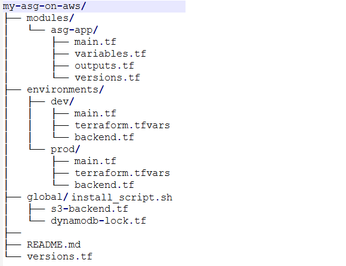
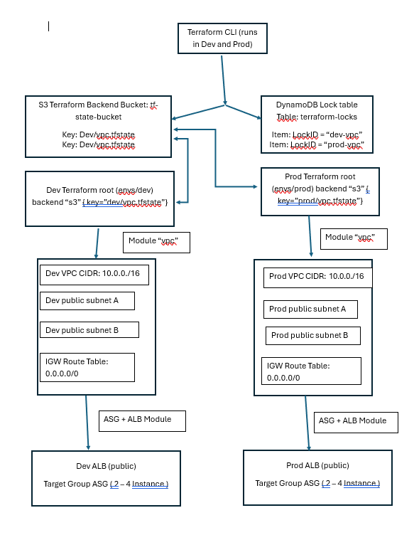

# my-asg-on-aws
## Auto Scaling Group on AWS with Terraform

## Introduction

The assignment is developed as a precursor for AWS Codepipeline implementation of auto-healing, web tier with implicit arrangement for Dev and prod instance and auto-update of Infrastructure on AWS. Following are the features of the current scheme:

    - Self-healing – terminating an instance triggers the platform to replace it automatically.
    - Self-provisioning (IaC only) – one command stands everything up; a second run makes no changes.
    - N + 1 capacity – traffic is spread across at least two instances behind a load balancer.
    - Static web page – a default static HTML page is created.
    Templates
        - Preferred: Terraform v-latest

## Prerequisites

Before we begin, make sure you have the following prerequisites in place:

- **An AWS account** with appropriate permissions to create and manage resources.
- **Terraform installed** on your local machine. You can download it from the official Terraform website and follow the installation instructions for your operating system.

## Auto Scaling Group on AWS with Terraform

The instances are created under ASG, which covers the Self-healing feature. The numbers of instances are configurable and it enables application availability, distribute traffic evenly, and optimize resource utilization.

## Directory Structure with Prod and Dev env




## Quick Start
1. cd global 
2. terraform apply
3. cd environments/dev && terraform init && terraform apply
4. cd ../prod && terraform init && terraform apply

## Features
- Modular reusable ASG + VPC + ALB
- Separate dev/prod environments
- S3 backend + DynamoDB locking
- ap-southeast-2 (Melbourne)
- CPU auto-scaling


## Infrastructure provisioning
The overall architecture is listed below:



**Setup Instructions**:	Create S3 bucket + DynamoDB globally once (terraform apply in global/):

```
cd global
terraform init && terraform apply
cd environments/dev
terraform init && terraform plan && terraform apply
cd ../prod
terraform init && terraform plan && terraform apply
```

**File description**:
Global S3 Backend (global/s3-backend.tf)
	S3 bucket is a global service which is used to store terraform state file with encrytion
	
```
# Create S3 bucket for Terraform state
resource "aws_s3_bucket" "terraform_state" {
  bucket = "project-singular-terraform-state-bucket-${random_id.bucket_suffix.hex}"  # change to your name

  tags = {
    Name = "Terraform State Bucket"
  }
}

resource "random_id" "bucket_suffix" {
  byte_length = 4
}

resource "aws_s3_bucket_versioning" "terraform_state_versioning" {
  bucket = aws_s3_bucket.terraform_state.id
  versioning_configuration {
    status = "Enabled"
  }
}

resource "aws_s3_bucket_server_side_encryption_configuration" "terraform_state_encryption" {
  bucket = aws_s3_bucket.terraform_state.id

  rule {
    apply_server_side_encryption_by_default {
      sse_algorithm = "AES256"
    }
  }
}

resource "aws_s3_bucket_public_access_block" "terraform_state_block" {
  bucket = aws_s3_bucket.terraform_state.id

  block_public_acls       = true
  block_public_policy     = true
  ignore_public_acls      = true
  restrict_public_buckets = true
}

output "s3_bucket_name" {
  value = aws_s3_bucket.terraform_state.id
}
```

**Global DynamoDB Lock (global/dynamodb-lock.tf)**:
    DynamoDB is used for state locking: it prevents more than one Terraform run from modifying the same S3 state file at the same time.
	
```
resource "aws_dynamodb_table" "terraform_locks" {
  name         = "terraform-state-locks"
  billing_mode = "PAY_PER_REQUEST"
  hash_key     = "LockID"

  attribute {
    name = "LockID"
    type = "S"
  }

  tags = {
    Name = "Terraform State Lock Table"
  }
}

output "dynamodb_table_name" {
  value = aws_dynamodb_table.terraform_locks.name
}
```


**ASG Module (modules/asg-app/main.tf)**: EC2 Instance Auto scaling group

```
resource "aws_vpc" "main" {
  cidr_block           = var.vpc_cidr
  enable_dns_support   = true
  enable_dns_hostnames = true

  tags = { Name = "${var.environment}-vpc" }
}

resource "aws_internet_gateway" "igw" {
  vpc_id = aws_vpc.main.id

  tags = { Name = "${var.environment}-igw" }
}

resource "aws_subnet" "public_subnet_a" {
  vpc_id                  = aws_vpc.main.id
  cidr_block              = var.subnet_cidrs[0]
  availability_zone       = "${var.region}a"
  map_public_ip_on_launch = true

  tags = { Name = "${var.environment}-public-subnet-a" }
}

resource "aws_subnet" "public_subnet_b" {
  vpc_id                  = aws_vpc.main.id
  cidr_block              = var.subnet_cidrs[1]
  availability_zone       = "${var.region}b"
  map_public_ip_on_launch = true

  tags = { Name = "${var.environment}-public-subnet-b" }
}

resource "aws_route_table" "public_rt" {
  vpc_id = aws_vpc.main.id

  route {
    cidr_block = "0.0.0.0/0"
    gateway_id = aws_internet_gateway.igw.id
  }

  tags = { Name = "${var.environment}-public-rt" }
}

resource "aws_route_table_association" "public_a" {
  subnet_id      = aws_subnet.public_subnet_a.id
  route_table_id = aws_route_table.public_rt.id
}

resource "aws_route_table_association" "public_b" {
  subnet_id      = aws_subnet.public_subnet_b.id
  route_table_id = aws_route_table.public_rt.id
}

# Security Groups
resource "aws_security_group" "instance_sg" {
  name_prefix = "${var.environment}-instance-"
  vpc_id      = aws_vpc.main.id

  dynamic "ingress" {
    for_each = var.inbound_ports
    content {
      from_port   = ingress.value
      to_port     = ingress.value
      protocol    = "tcp"
      cidr_blocks = ["0.0.0.0/0"]
    }
  }

  egress {
    from_port   = 0
    to_port     = 0
    protocol    = "-1"
    cidr_blocks = ["0.0.0.0/0"]
  }

  tags = { Name = "${var.environment}-instance-sg" }
}

resource "aws_security_group" "alb_sg" {
  name_prefix = "${var.environment}-alb-"
  vpc_id      = aws_vpc.main.id

  ingress {
    from_port   = 80
    to_port     = 80
    protocol    = "tcp"
    cidr_blocks = ["0.0.0.0/0"]
  }

  egress {
    from_port   = 0
    to_port     = 0
    protocol    = "-1"
    cidr_blocks = ["0.0.0.0/0"]
  }

  tags = { Name = "${var.environment}-alb-sg" }
}

# ALB
resource "aws_lb" "alb" {
  name               = "${var.environment}-asg-alb"
  internal           = false
  load_balancer_type = "application"
  security_groups    = [aws_security_group.alb_sg.id]
  subnets            = [aws_subnet.public_subnet_a.id, aws_subnet.public_subnet_b.id]

  tags = { Name = "${var.environment}-alb" }
}

resource "aws_lb_target_group" "tg" {
  name     = "${var.environment}-tg"
  port     = 80
  protocol = "HTTP"
  vpc_id   = aws_vpc.main.id

  health_check {
    path                = "/"
    interval            = 30
    timeout             = 5
    healthy_threshold   = 2
    unhealthy_threshold = 2
  }
}

resource "aws_lb_listener" "listener" {
  load_balancer_arn = aws_lb.alb.arn
  port              = "80"
  protocol          = "HTTP"

  default_action {
    type             = "forward"
    target_group_arn = aws_lb_target_group.tg.arn
  }
}

# Launch Template + ASG
resource "aws_launch_template" "lt" {
  name_prefix   = "${var.environment}-asg-"
  image_id      = var.ami_id
  instance_type = var.instance_type
  key_name      = var.key_name
  vpc_security_group_ids = [aws_security_group.instance_sg.id]

  user_data = base64encode(templatefile("${path.module}/../install_script.sh", {
    hostname_suffix = var.environment
  }))

  lifecycle {
    create_before_destroy = true
  }

  tag_specifications {
    resource_type = "instance"
    tags = { Name = "${var.environment}-asg-instance" }
  }
}

resource "aws_autoscaling_group" "asg" {
  name                = "${var.environment}-asg"
  vpc_zone_identifier = [aws_subnet.public_subnet_a.id, aws_subnet.public_subnet_b.id]
  
  target_group_arns   = [aws_lb_target_group.tg.arn]
  health_check_type   = "ELB"
  health_check_grace_period = 150

  min_size         = var.asg_min_size
  max_size         = var.asg_max_size
  desired_capacity = var.asg_desired_capacity

  launch_template {
    id      = aws_launch_template.lt.id
    version = "$Latest"
  }

  tag {
    key                 = "Name"
    value               = "${var.environment}-asg-instance"
    propagate_at_launch = true
  }
}

resource "aws_autoscaling_policy" "scale_up" {
  name                   = "${var.environment}-cpu-scale-up"
  autoscaling_group_name = aws_autoscaling_group.asg.name
  policy_type            = "TargetTrackingScaling"

  target_tracking_configuration {
    predefined_metric_specification {
      predefined_metric_type = "ASGAverageCPUUtilization"
    }
    target_value = 50.0
  }
}
```

The resources defined in this file are:

**aws_vpc.main**:Virtual Private Cloud that provides an isolated network (CIDR var.vpc_cidr) with DNS support/hostnames enabled.

**aws_internet_gateway.igw**: Internet Gateway attached to the VPC to allow resources in public subnets to reach the internet.

**aws_subnet.public_subnet_a**: First public subnet in the VPC (CIDR var.subnet_cidrs[0], AZ ${var.region}a) with auto‑assign public IPs enabled.

**aws_subnet.public_subnet_b**: Second public subnet in the VPC (CIDR var.subnet_cidrs[1], AZ ${var.region}b) with auto‑assign public IPs enabled.

**aws_route_table.public_rt**: Route table for the public subnets, with a default route (0.0.0.0/0) through the Internet Gateway.

**aws_route_table_association.public_a**: Associates public_subnet_a with the public route table.

**aws_route_table_association.public_b**: Associates public_subnet_b with the public route table.

**aws_security_group.instance_sg**: Security group for EC2 instances in the ASG:
Ingress: allows TCP on each port in var.inbound_ports from anywhere.
Egress: allows all outbound traffic.

**aws_security_group.alb_sg**: Security group for the Application Load Balancer:
Ingress: allows HTTP (TCP/80) from anywhere. Egress: allows all outbound traffic.

**aws_lb.alb**: Internet‑facing Application Load Balancer spanning the two public subnets, using alb_sg for network access control.

**aws_lb_target_group.tg**: Target group that holds the ASG instances behind the ALB, listening on HTTP port 80 with a basic health check on /.

**aws_lb_listener.listener**: Listener on the ALB (port 80, HTTP) that forwards all traffic to the target group tg.

**aws_launch_template.lt**: Launch Template defining how ASG instances are created: AMI, instance type, key pair, security group, and user‑data script; tagged and set to create_before_destroy.

**aws_autoscaling_group.asg**: Auto Scaling Group deploying instances across the two public subnets, attached to the ALB target group, with min/max/desired capacity and ELB health checks.

**aws_autoscaling_policy.scale_up**: Target tracking scaling policy that adjusts the ASG size to keep average CPU utilization around 50%.

## Conclusion
To conclude, implementing an Auto Scaling Group on AWS with Terraform provides a flexible and efficient solution for managing application scalability.