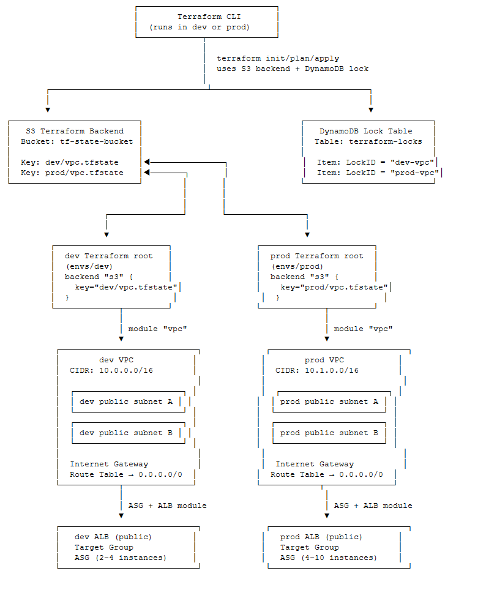

# my-asg-on-aws
# Auto Scaling Group on AWS with Terraform

## Introduction

The assignment is developed as a precursor for AWS Codepipeline implementation of auto-healing web tier with implicit arrangement for Dev and prod instance and auto-update of Infrastructure on AWS. Following are the features of the current scheme:

    - Self-healing – terminating an instance triggers the platform to replace it automatically.
    - Self-provisioning (IaC only) – one command stands everything up; a second run makes no changes.
    - N + 1 capacity – traffic is spread across at least two instances behind a load balancer.
    - Static web page – a default static HTML page is created.
    Templates
        - Preferred: Terraform v-latest

## Prerequisites

Before we begin, make sure you have the following prerequisites in place:

- **An AWS account** with appropriate permissions to create and manage resources.
- **Terraform installed** on your local machine. You can download it from the official Terraform website and follow the installation instructions for your operating system.

## Auto Scaling Group on AWS with Terraform

The instances are created under ASG, which covers the Self-healing feature. The numbers of instances are configurable and it enables application availability, distribute traffic evenly, and optimize resource utilization.

## Infrastructure provisioning
The overall architecture is listed below:




# Directory Structure with Prod and Dev env


### Step 1: Provider Configuration

Create a file named `provider.tf` with the following content:

```
provider "aws" {
  region = "ap-southeast-2"
}

terraform {
  required_providers {
    aws = {
      source  = "hashicorp/aws"
      version = "4.65.0"
    }
  }
}
```
 
### Step 2: Network Configuration

Create a file named `variables.tf` with the following content:

```
variable "inbound_ec2" {
  type        = list(any)
  default     = [22, 80]
  description = "inbound port allow on production instance"
}

variable "instance_type" {
  type    = string
  default = "m6i.large"
}

variable "ami" {
  type    = string
  default = "ami-0818a4d7794d429b1"
}

variable "key_name" {
  type    = string
  default = "asgawskey"
}

variable "availability_zone" {
  type    = list(string)
  default = ["ap-southeast-2a", "ap-southeast-2b"]
}

variable "vpc_cidr" {
  type    = string
  default = "10.0.0.0/16"
}

variable "subnet_cidrs" {
  type        = list(string)
  description = "list of all cidr for subnet"
  default     = ["10.0.1.0/24", "10.0.2.0/24"]
}
```

Create a file named `vpc.tf` with the following content:

```
resource "aws_vpc" "infrastructure_vpc" {
  cidr_block           = var.vpc_cidr
  enable_dns_support   = "true" #gives you an internal domain name
  enable_dns_hostnames = "true" #gives you an internal host name
  instance_tenancy     = "default"

  tags = {
    Name = "asg-vpc"
  }
}

#It enables our vpc to connect to the internet
resource "aws_internet_gateway" "infrastructure_igw" {
  vpc_id = aws_vpc.infrastructure_vpc.id
  tags = {
    Name = "asg-igw"
  }
}

#first public subnet
resource "aws_subnet" "first_public_subnet" {
  vpc_id                  = aws_vpc.infrastructure_vpc.id
  cidr_block              = var.subnet_cidrs[1]
  map_public_ip_on_launch = "true" //it makes this a public subnet
  availability_zone       = var.availability_zone[1]
  tags = {
    Name = "first public subnet"
  }
}

#second public subnet
resource "aws_subnet" "second_public_subnet" {
  vpc_id                  = aws_vpc.infrastructure_vpc.id
  cidr_block              = var.subnet_cidrs[0]
  map_public_ip_on_launch = "true" //it makes this a public subnet
  availability_zone       = var.availability_zone[0]
  tags = {
    Name = "second public subnet"
  }
}
```

### Step 3: Auto Scaling group 

Create a file named `main.tf` with the following content:

```
resource "aws_launch_template" "instances_configuration" {
  name_prefix            = "asg-instance"
  image_id               = var.ami
  key_name               = var.key_name
  instance_type          = var.instance_type
  user_data              = filebase64("install_script.sh")
  vpc_security_group_ids = [aws_security_group.instance_sg.id]

  lifecycle {
    create_before_destroy = true
  }

  tags = {
    Name = "asg-instance"
  }

}

resource "aws_autoscaling_group" "asg" {
  name                      = "asg"
  min_size                  = 2
  max_size                  = 4
  desired_capacity          = 2
  health_check_grace_period = 150
  health_check_type         = "ELB"
  vpc_zone_identifier       = [aws_subnet.first_public_subnet.id, aws_subnet.second_public_subnet.id]
  launch_template {
    id      = aws_launch_template.instances_configuration.id
    version = "$Latest"
  }

}

resource "aws_autoscaling_policy" "avg_cpu_policy_greater" {
  name                   = "avg-cpu-policy-greater"
  policy_type            = "TargetTrackingScaling"
  autoscaling_group_name = aws_autoscaling_group.asg.id
  # CPU Utilization is above 50
  target_tracking_configuration {
    predefined_metric_specification {
      predefined_metric_type = "ASGAverageCPUUtilization"
    }
    target_value = 50.0
  }

}

resource "aws_autoscaling_attachment" "asg_attachment" {
  autoscaling_group_name = aws_autoscaling_group.asg.id
  lb_target_group_arn    = aws_lb_target_group.alb_target_group.arn
}
```

Create a file named `install_script.sh` with the following content:

```
#!/bin/bash

sudo apt-get update
sudo apt-get install nginx -y
sudo systemctl enable nginx
sudo systemctl start nginx
EC2_AVAIL_ZONE=`curl -s http://169.254.169.254/latest/meta-data/placement/availability-zone`
echo "<h3 align='center'> Hello World from Availability zone for Cloud Infrastructure Engineer : $EC2_AVAIL_ZONE ; Hostname $(hostname -f) </h3>" > /var/www/html/index.html
sudo apt install stress -y
```

###Setup Instructions
Create S3 bucket + DynamoDB globally once (terraform apply in global/):

```
bash
cd global
terraform init && terraform apply
```

```
bash
cd environments/dev
terraform init && terraform plan && terraform apply
cd ../prod
terraform init && terraform plan && terraform apply
```

#File description
##Global S3 Backend (global/s3-backend.tf)
	S3 bucket is a global service which is used to store terraform state file with encrytion
	
```
# Create S3 bucket for Terraform state
resource "aws_s3_bucket" "terraform_state" {
  bucket = "project-singular-terraform-state-bucket-${random_id.bucket_suffix.hex}"  # change to your name

  tags = {
    Name = "Terraform State Bucket"
  }
}

resource "random_id" "bucket_suffix" {
  byte_length = 4
}

resource "aws_s3_bucket_versioning" "terraform_state_versioning" {
  bucket = aws_s3_bucket.terraform_state.id
  versioning_configuration {
    status = "Enabled"
  }
}

resource "aws_s3_bucket_server_side_encryption_configuration" "terraform_state_encryption" {
  bucket = aws_s3_bucket.terraform_state.id

  rule {
    apply_server_side_encryption_by_default {
      sse_algorithm = "AES256"
    }
  }
}

resource "aws_s3_bucket_public_access_block" "terraform_state_block" {
  bucket = aws_s3_bucket.terraform_state.id

  block_public_acls       = true
  block_public_policy     = true
  ignore_public_acls      = true
  restrict_public_buckets = true
}

output "s3_bucket_name" {
  value = aws_s3_bucket.terraform_state.id
}
```

##Global DynamoDB Lock (global/dynamodb-lock.tf)
    DynamoDB is used for state locking: it prevents more than one Terraform run from modifying the same S3 state file at the same time.
	
```
resource "aws_dynamodb_table" "terraform_locks" {
  name         = "terraform-state-locks"
  billing_mode = "PAY_PER_REQUEST"
  hash_key     = "LockID"

  attribute {
    name = "LockID"
    type = "S"
  }

  tags = {
    Name = "Terraform State Lock Table"
  }
}

output "dynamodb_table_name" {
  value = aws_dynamodb_table.terraform_locks.name
}```

